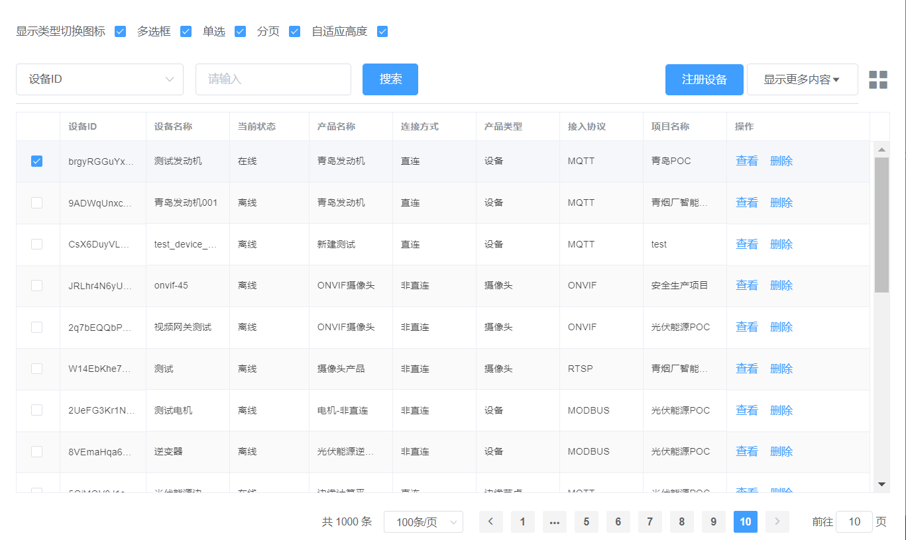
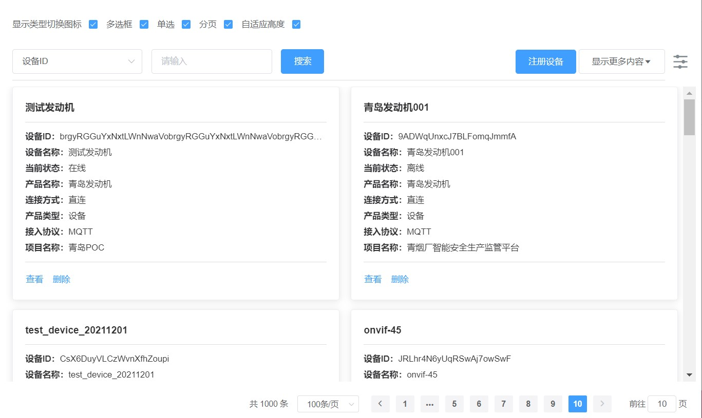

# ElTableChen

> 表格组件：1、集成 el-table 与 el-pagination 组件为一体,可进行前后端分页；2、表格高度自适应；3、表格与卡片两种展现方式；

## 安装

- 1. 由于组件依赖 element-ui,所以项目需要引入[element-ui](https://element.eleme.cn/#/zh-CN/component/quickstart)

- 2.  安装 ElTableChen
      ```shell
      npm i el-table-chen -S
      ```

## 注册

```javascript
import ElTableChen from "el-table-chen";
Vue.use(ElTableChen);
```

## 效果图

<p>表格</p>
<p align="center">

</p>
<p>卡片</p>
<p align="center">

</p>

## 使用示例

```javascript
<template>
  <div id="app">
    <div class="">
      <el-form :inline="true">
        <el-form-item label="显示类型切换图标">
          <el-checkbox v-model="elTableChenConfig.toggleConfig.show" />
        </el-form-item>
        <el-form-item label="多选框">
          <el-checkbox v-model="elTableChenConfig.selection" />
        </el-form-item>
        <el-form-item label="单选">
          <el-checkbox v-model="elTableChenConfig.single" />
        </el-form-item>
        <el-form-item label="分页">
          <el-checkbox v-model="elTableChenConfig.pagination" />
        </el-form-item>
        <el-form-item label="自适应高度">
          <el-checkbox v-model="elTableChenConfig.autoHeight" />
        </el-form-item>
      </el-form>
    </div>
    <ElTableChen v-bind="elTableChenConfig" ref="ElTableChen">
      <template #header="{ $data }">
        <div class="header-wrapper">
          <div
            class="dflex form-wrapper"
            style="justify-content: space-between"
          >
            <el-form :inline="true" :model="queryForm">
              <el-form-item label="">
                <el-select v-model="queryForm.selectKey" placeholder="设备名称">
                  <el-option
                    v-for="item in elTableChenConfig.columnsConfig"
                    :key="item.prop"
                    :label="item.label"
                    :value="item.prop"
                  >
                  </el-option>
                </el-select>
              </el-form-item>
              <el-form-item label="">
                <el-input
                  v-model="queryForm.value"
                  placeholder="请输入"
                ></el-input>
              </el-form-item>
              <el-form-item>
                <el-button @click="refreshTable()" type="primary"
                  >搜索</el-button
                >
              </el-form-item>
            </el-form>
            <div class="mgb20">
              <el-button type="primary"> 注册设备 </el-button>
              <el-dropdown :hide-on-click="false">
                <el-button class="mgl10">
                  显示更多内容<i class="el-icon-caret-bottom mgl10"></i>
                </el-button>
                <el-dropdown-menu slot="dropdown" class="more">
                  <el-dropdown-item>
                    <div style="width: 82px"></div>
                  </el-dropdown-item>
                  <el-dropdown-item
                    v-for="item in elTableChenConfig.columnsConfig"
                    :key="item.prop"
                  >
                    <el-checkbox
                      :checked="!item.hidden"
                      @change="(val) => changeColumn(val, item)"
                      >{{ item.label }}</el-checkbox
                    >
                  </el-dropdown-item>
                </el-dropdown-menu>
              </el-dropdown>
            </div>
          </div>
        </div>
      </template>
      <template #keepAlive="{ scope }">
        <div>
          {{ scope.row.keepAlive ? "在线" : "离线" }}
        </div>
      </template>
      <!-- <template #card="{ scope }">
        <div>卡片自定义模板</div>
      </template> -->
      <template #handle>
        <div>
          <el-button type="text">查看</el-button>
          <el-button type="text"><span>删除</span></el-button>
        </div>
      </template>
    </ElTableChen>
  </div>
</template>

<script>
import tableData from "./mock";
export default {
  name: "App",
  data() {
    return {
      queryForm: {
        selectKey: "code",
        value: "",
      },
      elTableChenConfig: {
        apiFn: (query) => {
          // 如果apiFn不为空，则调用此函数，否则数据表格数据直接读取tableData属性
          // 远程获取数据函数,函数需返回Promise，真实场景可以直接返回axios
          // demo
          console.log(query);
          return new Promise((resolve, reject) => {
            setTimeout(() => {
              // 返回数据固定为以下两种数据结构
              let data = { data: { list: tableData, totalCount: 1000 } };
              // let data = { data: tableData };
              resolve(data);
            }, 1000);
          });
        },
        type: "table", //card(卡片) or table(表格)
        containerId: "#app", // 组件容器id
        toggleConfig: {
          //切换配置
          show: true, //是否显示
          tableIconClass: "el-icon-s-operation", //表格图标类名
          cardIconClass: "el-icon-menu", //卡片图标类名
          tgClass: "", // 容器类名
        },
        tableConfig: {
          // 同el-table表格属性配置https://element.eleme.cn/#/zh-CN/component/table#table-attributes
          size: "mini",
        },
        cardConfig: {
          // 卡片配置
          slotName: "", // 卡片插槽名
        },
        columnsConfig: [
          // 表格列配置，同el-table-column配置https://element.eleme.cn/#/zh-CN/component/table#table-attributes；增加slotName属性，如果存在，则优先使用插槽名为slotName属性值的数据
          {
            prop: "code",
            label: "设备ID",
            minWidth: 100,
            fixed: "left",
            hidden: false,
          },
          {
            prop: "name",
            label: "设备名称",
            minWidth: 100,
            hidden: false,
          },
          {
            prop: "keepAlive",
            label: "当前状态",
            width: 100,
            slotName: "keepAlive",
            hidden: false,
          },
          {
            prop: "productName",
            label: "产品名称",
            minWidth: 100,
            hidden: false,
          },
          {
            prop: "productLinkName",
            label: "连接方式",
            minWidth: 100,
            hidden: false,
          },
          {
            prop: "productTypeName",
            label: "产品类型",
            minWidth: 100,
            hidden: false,
          },
          {
            prop: "productAgreementName",
            label: "接入协议",
            minWidth: 100,
            hidden: false,
          },
          {
            prop: "projectName",
            label: "项目名称",
            minWidth: 100,
            hidden: false,
          },
          {
            prop: "createTime",
            label: "注册时间",
            width: 160,
            hidden: true,
          },
          {
            prop: "activeTime",
            label: "激活时间",
            width: 160,
            hidden: true,
          },
          {
            prop: "lastMessageTime",
            label: "最后消息时间",
            width: 160,
            hidden: true,
          },

          {
            prop: "format",
            label: "数据格式",
            minWidth: 100,
            slotName: "format",
            hidden: true,
          },
          {
            label: "操作",
            width: 180,
            fixed: "right",
            slotName: "handle",
            hidden: false,
            notDropDownItem: true,
          },
        ],
        query: "a=b&c=d", // 查询条件，字符串或者对象a=b&c=d、{a:b}；
        autoGetData: true, // 是否自动加载数据
        offsetHeight: 160, // 高度偏移,值越大组件高度越小
        selection: true, // 显示多选框
        single: true, // 单选
        pagination: true, // 分页
        pageSizes: [10, 20, 50, 70, 100], // 分页配置
        currentRow: true, // 当前行高亮
        noDefaultHeight: false, // 是否没有默认高度
        minHeight: 200, // 表格最小高度
        maxTableHeight: 5000000, // 表格最大高度
        autoHeight: true, // 自适应高度
        tableData: tableData, // 表格数据
        rowKey: "id", // 行key
        defaultSelectionKeys: [122], // 默认选中
        finishCallBack: () => {},
      },
    };
  },
  methods: {
    refreshTable() {},
    // 勾选"显示更多项目"调用
    changeColumn(val, item) {
      this.$set(item, "hidden", !val);
      // this.$set(item, "hidden");
      this.$nextTick(() => {
        this.$refs.ElTableChen && this.$refs.ElTableChen.doLayout();
      });
    },
  },
};
</script>

<style>
#app {
  font-family: "Avenir", Helvetica, Arial, sans-serif;
  -webkit-font-smoothing: antialiased;
  -moz-osx-font-smoothing: grayscale;
  color: #2c3e50;
  position: absolute;
  top: 20px;
  right: 20px;
  bottom: 20px;
  left: 20px;
}
.dflex {
  display: flex;
}
.flex {
  flex: 1;
}
.header-wrapper {
  margin: 10px 0;
  border-bottom: 1px solid #ddd;
}
.el-form-item {
  margin-bottom: 10px;
}
</style>
```
